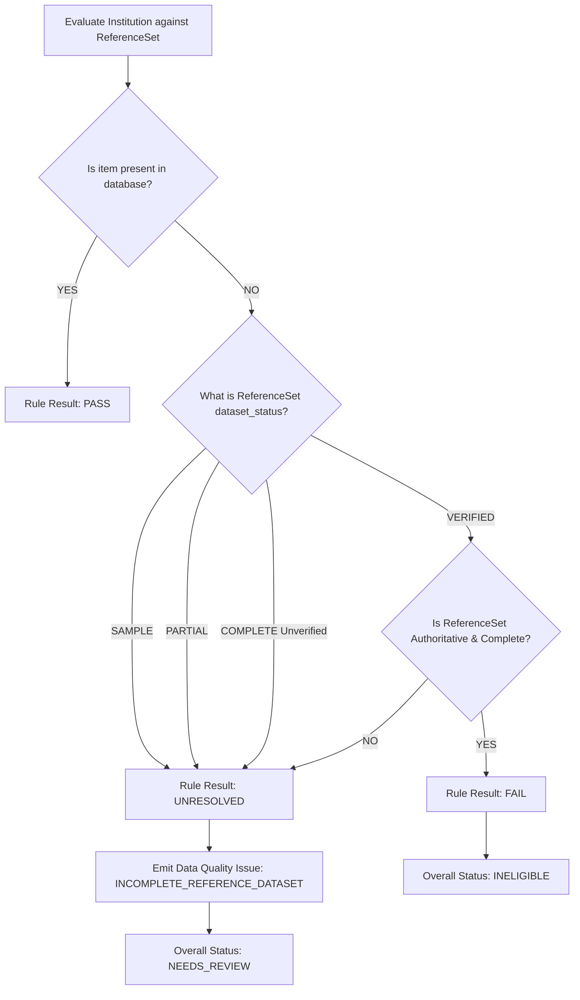

# Reference Data Completeness & Dataset Status Semantics

## 1. Statutory Context & The Incompleteness Invariant

In government scholarship administration, local IT system databases rarely ingest the entire universe of statutory gazette notifications on day one. For instance:
- **Top Class Education Scheme**: The Ministry of Tribal Affairs officially empanels **265 premier institutions** (IITs, NITs, IIMs, AIIMS, National Law Universities, Central Universities).
- **Initial Prototype Database**: Contains a seed batch of **7 representative institutions** (`TOP_CLASS_PREMIER_INSTITUTES_SAMPLE`).

If a tribal student applies from IIT Goa (institution #8), a naive database query (`institute_code in database`) yields `False`. If treated as a rule failure, the system would issue an unjust, illegal disqualification notice: `INELIGIBLE`.

### The Non-Negotiable Invariant
> **The system cannot distinguish between "institution is not officially eligible" and "institution has not yet been ingested into our local database." Therefore, missing data from an incomplete reference dataset must NEVER produce an `INELIGIBLE` verdict.**

---

## 2. Dataset Status Lifecycle

Every `ReferenceSet` in the database is tagged with a statutory `dataset_status`:

| Dataset Status | Operational Meaning | Record Count Integrity | Missing Item Result |
| :--- | :--- | :--- | :--- |
| **`SAMPLE`** | Small representative subset for demonstration/testing (e.g., 7 of 265 records). | $0 < \text{loaded} < \text{expected}$ | **`UNRESOLVED`** $\to$ `NEEDS_REVIEW` |
| **`PARTIAL`** | Ingestion in progress (e.g., North-Eastern region ingested, southern pending). | $0 < \text{loaded} < \text{expected}$ | **`UNRESOLVED`** $\to$ `NEEDS_REVIEW` |
| **`COMPLETE`** | 100% of official records ingested, but pending final gazette verification or sign-off. | $\text{loaded} == \text{expected}$ | **`UNRESOLVED`** $\to$ `NEEDS_REVIEW` |
| **`VERIFIED`** | 100% loaded, cross-referenced against gazette source document, and cryptographically verified. | $\text{loaded} == \text{expected}$ | **`FAIL`** $\to$ `INELIGIBLE` (Authoritative) |

---

## 3. Strict Evaluation Behavior Matrix

When `RuleEvaluationService` evaluates an `IN_SET` or reference set check:



### Explanation Generated for Incomplete Datasets
When an item is absent from an incomplete dataset (`SAMPLE`, `PARTIAL`, or unverified `COMPLETE`):
```json
{
  "rule_id": "TOP_CLASS_2025_PREMIER_INSTITUTE",
  "result": "UNRESOLVED",
  "observed_value": "IIT_GOA_001",
  "operator": "IN_SET",
  "required_value": "TOP_CLASS_PREMIER_INSTITUTES_SAMPLE",
  "explanation": "Reference data is incomplete. Eligibility cannot be conclusively determined from the currently loaded official dataset."
}
```

### Data Quality Issue Emitted
```json
{
  "type": "INCOMPLETE_REFERENCE_DATASET",
  "rule_code": "TOP_CLASS_2025_PREMIER_INSTITUTE",
  "reference_set": "TOP_CLASS_PREMIER_INSTITUTES_SAMPLE",
  "expected_records": 265,
  "loaded_records": 7,
  "description": "Reference data is incomplete. Eligibility cannot be conclusively determined from the currently loaded official dataset."
}
```

---

## 4. Current Schemes & Reference Set Status

### Top Class Education Scheme
- **Rule Code**: `TOP_CLASS_2025_PREMIER_INSTITUTE`
- **Reference Set**: `TOP_CLASS_PREMIER_INSTITUTES_SAMPLE`
- **Expected Records**: 265 empanelled premier institutions
- **Loaded Records**: 7 sample institutions
- **Dataset Status**: `SAMPLE`
- **Behavior**: Any institution outside the 7 sample records triggers `UNRESOLVED` and flags `NEEDS_REVIEW`. It is routed to the human Scrutiny Officer with an explicit reference dataset diagnostic warning.

### National Fellowship for ST Students (NFST)
- **Rule Code**: `NFST_2025_INSTITUTION_ELIGIBILITY`
- **Reference Set**: `NFST_RECOGNIZED_INSTITUTIONS_SAMPLE`
- **Expected Records**: 1200+ recognized UGC/INU universities
- **Loaded Records**: 5 sample institutions
- **Dataset Status**: `SAMPLE`
- **Behavior**: Candidates whose research institutions are not in the sample set are preserved under `NEEDS_REVIEW` rather than disqualified.

---

## 5. Transition to Full Authoritative Verification

To transition a `ReferenceSet` to `VERIFIED`:
1. **Source Document Provenance**: Link the dataset to the gazette PDF (`SourceDocument`) with checksum and publication date.
2. **Bulk Ingestion**: Load the full record count (e.g., all 265 institutions).
3. **Integrity Validation**: Ensure `record_count_loaded == record_count_expected`.
4. **Statutory Integrity Check**: Run `python manage.py validate_schemes`.
5. **Promotion**: Set `dataset_status = DatasetStatus.VERIFIED`.
