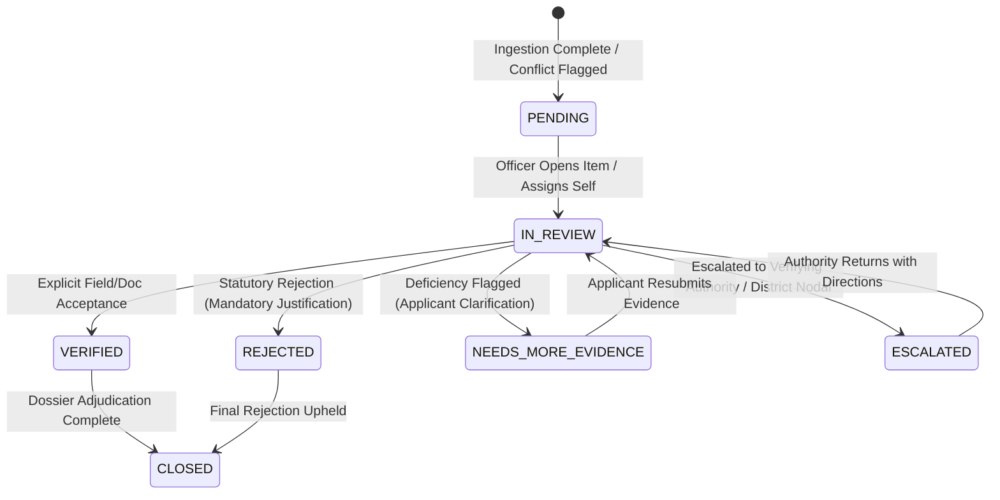

# Phase 9: Officer Verification & Audit Workspace Architecture

## 1. Overview & Statutory Foundation

The **Tribal Scholar Officer Verification & Audit Workspace** provides an evidentiary review interface and deterministic audit infrastructure for authorized Scrutiny Officers, Verifying Authorities, and Sanctioning Authorities under the Ministry of Tribal Affairs (MoTA).

The system enforces a non-negotiable separation between:
1. **Document Security Screening:** Antivirus, malware, and decompression safety checks (`SAFE`).
2. **Provisional Optical Character Recognition (OCR):** Machine extraction from scanned records (`OCR_PROVISIONAL`, Trust Rank 10).
3. **Evidentiary Verification:** Explicit, human-adjudicated evidentiary validation (`OFFICER_VERIFIED`, Trust Rank 60 / `VERIFIED_DOCUMENT`, Trust Rank 40).
4. **Deterministic Eligibility Evaluation:** Pure rule evaluation executed exclusively by the Scheme Rule Engine.

```
+-----------------------------------------------------------------------------------+
|                            SOVEREIGN PIPELINE ARCHITECTURE                        |
+-----------------------------------------------------------------------------------+
|  [Uploaded File]                                                                  |
|         |                                                                         |
|         v                                                                         |
|  [Security Gate: ClamAV / Magic Bytes / Bomb Check] ---> (SAFE != VERIFIED)      |
|         |                                                                         |
|         v                                                                         |
|  [Asynchronous Celery OCR: PaddleOCR 3.7.0 (CPU, 700px)]                         |
|         |                                                                         |
|         v                                                                         |
|  [Provisional Extracted Fields] (Rank 10)                                         |
|         |                                                                         |
|         +---> Comparison against Applicant Declaration (Rank 20)                 |
|         |           |                                                             |
|         |           +---> Discrepancy? ---> [VerificationQueueItem] (CONFLICT)    |
|         |                                                |                        |
|         +------------------------------------------------+                        |
|                                                          |                        |
|                                                          v                        |
|  [Officer Verification Workspace] <--- (RBAC: SCRUTINY_OFFICER, Atomic Row Lock)  |
|         |                                                                         |
|         +---> Explicit Human Adjudication (VERIFY / REJECT / DEFICIENT / ESCALATE)|
|         +---> Append-Only Audit Log Generation (UUID correlated)                 |
|         |                                                                         |
|         v                                                                         |
|  [Promoted Authoritative Evidence] (Rank 60: OFFICER_VERIFIED)                    |
|         |                                                                         |
|         v                                                                         |
|  [Deterministic Scheme Rule Engine]                                              |
|         |                                                                         |
|         v                                                                         |
|  [Application Eligibility Outcome: PASS / FAIL / NEEDS_REVIEW]                    |
+-----------------------------------------------------------------------------------+
```

---

## 2. Statutory Trust Hierarchy

The statutory trust hierarchy is immutable and canonical across backend data models, evaluation dossiers, and user interfaces:

| Trust Level | Numeric Rank | Authority Description | Can Overwrite Lower Ranks? |
| :--- | :---: | :--- | :---: |
| **`OFFICER_VERIFIED`** | **60** | Explicit adjudication by authorized Scrutiny Officer | Yes |
| **`OFFICIAL_INTEGRATION`** | **50** | Verified API integration (e.g., DigiLocker, Jan Parichay) | Yes |
| **`VERIFIED_DOCUMENT`** | **40** | Document-level acceptance by authorized officer | Yes |
| **`SYSTEM`** | **30** | Algorithmic or platform system metadata | Yes |
| **`APPLICANT_DECLARED`** | **20** | Applicant self-declaration on application form | Yes (over provisional) |
| **`OCR_PROVISIONAL`** | **10** | Machine-extracted PaddleOCR reading | **NO (Never)** |

### Non-Negotiable Invariants:
1. **OCR Never Outranks Officer Verification:** An OCR confidence score of 99.9% remains Trust Rank 10 and cannot override Rank 20 (`APPLICANT_DECLARED`) or Rank 60 (`OFFICER_VERIFIED`).
2. **OCR Never Silently Overwrites:** Discrepancies between OCR values and applicant-declared values automatically yield a `MATERIAL_CONFLICT` queue item.
3. **No Automatic Promotion:** Machine extraction cannot transition to `OFFICER_VERIFIED` without an explicit, recorded officer action and justification.

---

## 3. Verification Lifecycle & State Machine

Verification records and queue items progress through a deterministic, strictly validated finite state machine:



### Valid Lifecycle Transitions:
* `PENDING` -> `IN_REVIEW`, `VERIFIED`, `REJECTED`, `NEEDS_MORE_EVIDENCE`, `ESCALATED`
* `IN_REVIEW` -> `VERIFIED`, `REJECTED`, `NEEDS_MORE_EVIDENCE`, `ESCALATED`
* `NEEDS_MORE_EVIDENCE` -> `IN_REVIEW`, `REJECTED`
* `ESCALATED` -> `IN_REVIEW`, `VERIFIED`, `REJECTED`
* `VERIFIED` -> `CLOSED`
* `REJECTED` -> `CLOSED`

Any attempt to transition from a finalized state (`CLOSED`, `VERIFIED`, `REJECTED`) without an authorized reopening process is rejected with `ValidationError` to enforce idempotency.

---

## 4. Conflict Handling & Resolution Semantics

When machine-extracted OCR values differ materially from applicant self-declarations:
1. **Dual Preservation:** Both the applicant declaration (`value_applicant`, Rank 20) and the OCR reading (`value_provisional`, Rank 10) are preserved with full cryptographic checksums and provenance.
2. **Conflict Queue Creation:** A `VerificationQueueItem` is spawned with `conflict_type="MATERIAL_CONFLICT"` and `status="CONFLICT"`.
3. **Authoritative Resolution Choices:** The Scrutiny Officer is presented with explicit resolution pathways:
   - **`USE_DOCUMENT_VALUE`:** Accepts the documentary OCR reading. The value is promoted to `OFFICER_VERIFIED` (Rank 60).
   - **`USE_APPLICANT_DECLARATION`:** Accepts the applicant's self-declaration (e.g., supported by supplementary gazetted affidavits). Promoted to `OFFICER_VERIFIED` (Rank 60).
   - **`NEEDS_MORE_EVIDENCE`:** Flags the discrepancy to the applicant; requests a fresh certificate or clarification.
   - **`ESCALATE`:** Refers the discrepancy to the District Nodal Officer / Verifying Authority.

---

## 5. Security Screening vs. Document Verification Boundary

The system strictly enforces the boundary between file security and evidentiary acceptance:

* **`SAFE` (File Security Ingestion):**
  - Managed by `DocumentSecurityScanner` (ClamAV antivirus daemon, Libmagic byte signature validation, ZIP/PDF bomb decompression bounds).
  - A document marked `SAFE` merely indicates it contains no malware or exploit payloads.
  - **`SAFE != VERIFIED`**.

* **`VERIFIED_DOCUMENT` (Evidentiary Acceptance):**
  - Assigned exclusively by an authenticated human officer following scrutiny of the document canvas, digital seals, issuing authority, and validity dates.
  - Grants the document evidence Trust Rank 40.
  - Un-scanned documents (`INITIATED`, `UPLOADING`, `SCANNING`, `QUARANTINED`) cannot be verified.

---

## 6. API Architecture & REST Endpoints

All endpoints are built using Django REST Framework (DRF), secured with `IsAuthenticated` and `IsReviewerOrOfficer` permissions:

| Endpoint | Method | Purpose | RBAC Policy |
| :--- | :---: | :--- | :--- |
| `/api/verification/queue/` | `GET` | Paginated listing of verification tasks with filtering | Officer / Admin |
| `/api/verification/queue/<id>/` | `GET` | Comprehensive detail view of queue item, OCR & declared data | Officer / Admin |
| `/api/verification/queue/<id>/assign/` | `POST` | Self-assignment or administrative delegation of queue item | Officer / Admin |
| `/api/verification/queue/<id>/verify-field/` | `POST` | Field-level verification with provenance upgrade | Officer / Admin |
| `/api/verification/queue/<id>/resolve-conflict/` | `POST` | Conflict resolution (`USE_DOCUMENT_VALUE`, etc.) | Officer / Admin |
| `/api/verification/queue/<id>/escalate/` | `POST` | Statutory escalation with mandatory notes | Officer / Admin |
| `/api/verification/queue/<id>/needs-evidence/` | `POST` | Raise deficiency for applicant clarification | Officer / Admin |
| `/api/verification/verify-document/` | `POST` | Mark document as `VERIFIED_DOCUMENT` (Rank 40) | Officer / Admin |
| `/api/verification/history/<app_id>/` | `GET` | Audit trail of all actions performed on application | Officer / Admin |

---

## 7. Role-Based Access Control (RBAC) & IDOR Defenses

### Separation of Duties
* **Applicants (`STUDENT`):**
  - Restricted strictly to viewing their own application status and deficiency notices.
  - Barred from accessing verification queue endpoints (`HTTP 403 Forbidden`).
  - Barred from verifying their own documents or adjudicating conflicts, even if an application ID is maliciously injected into request payloads.
* **Scrutiny Officers (`SCRUTINY_OFFICER`):**
  - Authorized to claim queue items, inspect document evidence, verify fields, resolve conflicts, and raise deficiencies.
* **Verifying Authorities (`VERIFYING_AUTHORITY`):**
  - Authorized to adjudicate escalated items and finalize zonal recommendations.
* **Sanctioning Officers & Admins (`SANCTIONING_OFFICER`, `ADMIN`):**
  - Full audit oversight, re-assignment capabilities, and final sanction authorization.

### Insecure Direct Object Reference (IDOR) Protections
* Every queue item lookup verifies the officer's institutional/district jurisdiction or administrative privileges.
* Non-officer users attempting direct access to `/api/verification/queue/<uuid>/` are blocked at the DRF permission gate with explicit audit logging of the unauthorized access attempt.

---

## 8. Concurrency & Adjudication Safety

To prevent race conditions where two officers open the same queue item and submit conflicting determinations simultaneously:

1. **Pessimistic Row Locking (`select_for_update`):**
   ```python
   with transaction.atomic():
       item = VerificationQueueItem.objects.select_for_update().get(id=queue_item_id)
       if item.status in [VerificationStatus.VERIFIED, VerificationStatus.REJECTED, VerificationStatus.CLOSED]:
           raise ValidationError("Queue item has already been finalized by another officer.")
       # Perform state mutation and append audit log...
   ```
2. **Idempotency Guarantee:**
   If Officer A submits a `VERIFY` decision, Officer B's subsequent submission fails safely with a validation error, preventing double-processing, state corruption, or duplicate audit events.

---

## 9. Immutable Audit Trail

Every state mutation in the verification workspace generates an append-only audit event in `AuditLog` and a corresponding `DocumentVerificationRecord`:

* **`AuditLog` Properties:**
  - `action`: `FIELD_VERIFIED`, `DOCUMENT_EVIDENCE_VERIFIED`, `FIELD_CONFLICT_RESOLVED`, `VERIFICATION_ESCALATED`, `DEFECT_FLAGGED`.
  - `actor`: Foreign key to `User` (Scrutiny Officer).
  - `actor_role`: String snapshot of active role (`SCRUTINY_OFFICER`).
  - `target_model` & `target_id`: Identifiers for the application or document.
  - `metadata`: Contains previous value, new value, previous trust rank, new trust rank, correlation ID, and justification reason.
* **Immutability Enforcement:**
  - `AuditQuerySet` overrides `.update()` and `.delete()` to raise `ValidationError`.
  - Direct database updates are prohibited; audit records are strictly append-only.

---

## 10. Eligibility Engine Handoff

The Verification Workspace respects the statutory rule engine boundary:
* **The Officer Never Decides Eligibility:** The officer does not set an application to `ELIGIBLE` or `REJECTED`. The officer solely validates the truth and reliability of documentary evidence.
* **Automatic Re-Evaluation:** When field verification promotes an authoritative value (e.g., verifying `annual_family_income` from declared `500,000` to certificate `450,000`), `RuleEvaluationService.evaluate(application)` is triggered.
* **Deterministic Aggregation:** The rule engine evaluates scheme thresholds against the promoted `OFFICER_VERIFIED` evidence:
  - If verified income $\le$ scheme ceiling $\implies$ `PASS`.
  - If evidence remains unverified $\implies$ `NEEDS_REVIEW`.
  - Uncertainty is never automatically converted to rejection.
