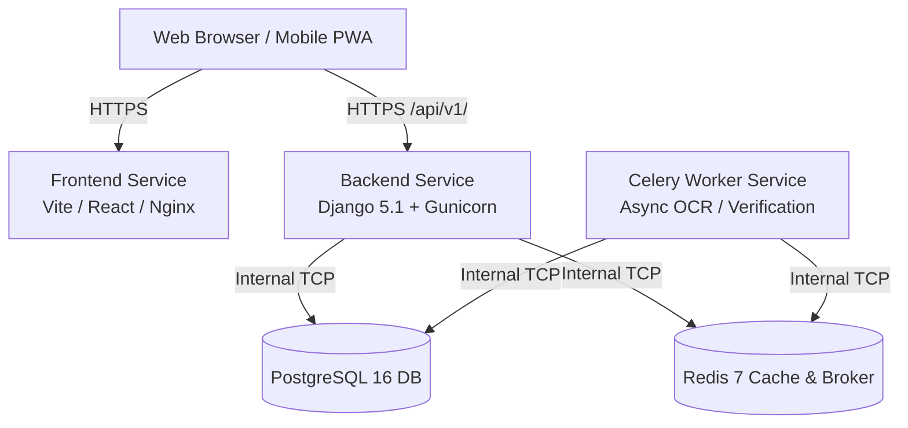

# Deploying Tribal Scholar to Railway

This document details the configuration, architecture, and step-by-step instructions for deploying the **Tribal Scholar Management System** on [Railway](https://railway.app).

---

## 🏗️ Architecture on Railway

Railway provisions and connects the components inside a single unified project:



### Components

| Service / Resource | Type | Build Context / Image | Start Command |
|---|---|---|---|
| **PostgreSQL** | Railway Database Plugin | Managed Postgres 16 | Automatic |
| **Redis** | Railway Database Plugin | Managed Redis 7 | Automatic |
| **Backend API** | Railway Web Service | `Dockerfile.backend` (or `/backend`) | `/app/start.sh` (Migrate + Seed + Collectstatic + Gunicorn) |
| **Celery Worker** | Railway Service | `Dockerfile.backend` (or `/backend`) | `celery -A tribel_scholar worker --loglevel=info` |
| **Frontend PWA** | Railway Web Service | `frontend/Dockerfile` | `nginx -g 'daemon off;'` (Dynamic `$PORT`) |

---

## 🚀 Option A: Deploy via Railway Web Dashboard (Recommended)

This is the fastest, standard method with zero CLI setup and automatic GitHub deployment tracking.

### Step 1: Create a New Project on Railway
1. Go to [railway.app](https://railway.app) and sign in with GitHub.
2. Click **"+ New Project"**.

### Step 2: Provision Database and Cache
1. Click **"+ Create"** -> **"Database"** -> **"Add PostgreSQL"**.
2. Click **"+ Create"** -> **"Database"** -> **"Add Redis"**.

### Step 3: Add Backend Service (Django API)
1. In the project canvas, click **"+ Create"** -> **"GitHub Repo"**.
2. Select your repository: `KrishRaj-0821/tribal_scholar`.
3. In **Settings**:
   - **Service Name**: `backend`
   - **Dockerfile Path**: `Dockerfile.backend` (or set **Root Directory** to `/backend` and use `backend/Dockerfile`)
4. In **Variables**:
   - `DATABASE_URL`: `${{Postgres.DATABASE_URL}}` *(Automatically populated by Railway)*
   - `REDIS_URL`: `${{Redis.REDIS_URL}}` *(Automatically populated by Railway)*
   - `DJANGO_SECRET_KEY`: *(Generate a secure random string or let default apply)*
   - `DJANGO_DEBUG`: `False`
   - `DJANGO_ALLOWED_HOSTS`: `*`
   - `CSRF_TRUSTED_ORIGINS`: `https://*.railway.app,https://*.up.railway.app`
   - `STORAGE_BACKEND`: `local`
5. In **Networking**:
   - Click **"Generate Domain"** to get your public backend URL (e.g., `https://backend-production-xxxx.up.railway.app`).

### Step 4: Add Celery Worker Service (Optional / Recommended for Background Tasks)
1. Click **"+ Create"** -> **"GitHub Repo"** -> `KrishRaj-0821/tribal_scholar`.
2. In **Settings**:
   - **Service Name**: `celery-worker`
   - **Dockerfile Path**: `Dockerfile.backend`
   - **Start Command**: `celery -A tribel_scholar worker --loglevel=info`
3. In **Variables**:
   - Reference the same `${{Postgres.DATABASE_URL}}` and `${{Redis.REDIS_URL}}`.

### Step 5: Add Frontend Service (React Vite PWA)
1. Click **"+ Create"** -> **"GitHub Repo"** -> `KrishRaj-0821/tribal_scholar`.
2. In **Settings**:
   - **Service Name**: `frontend`
   - **Root Directory**: `frontend`
   - **Dockerfile Path**: `frontend/Dockerfile`
3. In **Networking**:
   - Click **"Generate Domain"** to get your public frontend URL.

---

## 💻 Option B: Deploy via Railway CLI

If you prefer deploying directly from your terminal:

### 1. Authenticate with Railway
```bash
npx @railway/cli login
```
*(Follow browser prompt or use `npx @railway/cli login --browserless` if on a remote terminal).*

### 2. Initialize and Link Project
```bash
# Create new project linked to current directory
npx @railway/cli init

# Add PostgreSQL and Redis
npx @railway/cli add --database postgres
npx @railway/cli add --database redis
```

### 3. Deploy
```bash
npx @railway/cli up
```

---

## ⚙️ Environment Variables Reference

| Variable | Default / Value | Description |
|---|---|---|
| `DATABASE_URL` | Supplied by Railway Postgres | Connection URI (`postgresql://...`) |
| `REDIS_URL` | Supplied by Railway Redis | Connection URI (`redis://...`) |
| `DJANGO_DEBUG` | `False` in prod | Set to `False` in production |
| `DJANGO_SECRET_KEY` | Auto-generated / Secure string | Django encryption and session signing |
| `DJANGO_ALLOWED_HOSTS` | `*` or `.railway.app,.up.railway.app` | Host headers permitted |
| `CSRF_TRUSTED_ORIGINS` | `https://*.railway.app,https://*.up.railway.app` | Avoids CSRF failures on HTTPS |
| `CORS_ALLOWED_ORIGINS` | Comma-separated domains | Allows frontend to reach backend APIs |
| `GUNICORN_WORKERS` | `2` | Number of worker processes |
| `GUNICORN_THREADS` | `4` | Number of threads per worker |
| `PORT` | Dynamic from Railway | Port to bind Gunicorn and Nginx |
| `STORAGE_BACKEND` | `local` (or `minio` / `s3`) | Object storage backend |

---

## 🔍 Verification & Health Checks
- **API Root**: `GET https://<your-backend-url>/api/v1/` returns JSON list of API endpoints.
- **Django Admin**: `GET https://<your-backend-url>/admin/` loads the admin dashboard with full static styling.
- **Scheme Integrity**: Schemes (`NFST`, `TOP_CLASS`, `NOS`) are seeded automatically on first boot.
- **Frontend App**: `GET https://<your-frontend-url>/` loads the sovereign portal interface.
