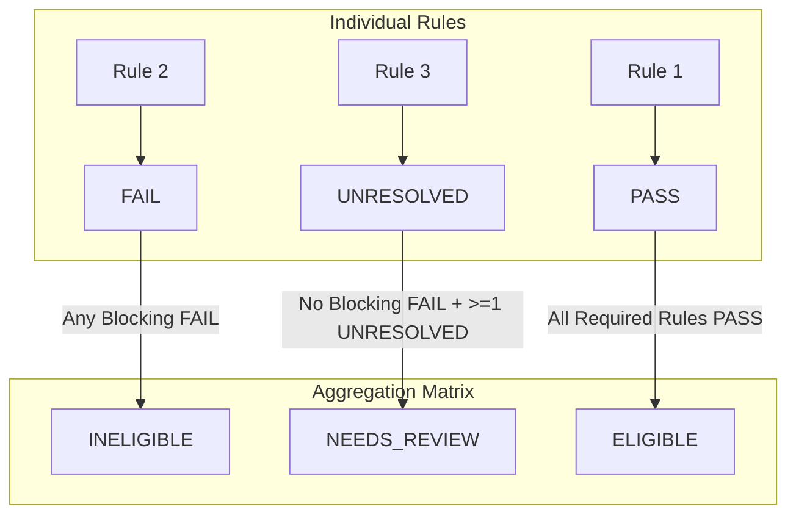

# Statutory Rule Evaluation Semantics & Three-State Logic

## 1. Three-State Rule Evaluation Logic

In public administrative law, an eligibility determination cannot be reduced to a binary `TRUE` / `FALSE`. When evidence is incomplete or guidelines are pending administrative verification, forced binary evaluations inevitably disenfranchise deserving citizens.

The engine evaluates every statutory rule into exactly one of three states:



### Evaluation States
1. **`PASS`**: The evidence definitively meets the statutory criteria.
2. **`FAIL`**: The evidence definitively violates a verified statutory criterion (e.g., declared income exceeds the legal ceiling).
3. **`UNRESOLVED`**: The criterion cannot be conclusively decided because required evidence, reference master data, or official verification is pending.

### Overall Aggregation Rules
- **`INELIGIBLE`**: Triggered if **any** rule with `severity = BLOCKING` produces `FAIL`.
- **`NEEDS_REVIEW`**: Triggered if there are **no** blocking failures, but **one or more** required rules produce `UNRESOLVED` (or data quality issues are detected).
- **`ELIGIBLE`**: Triggered if and only if **all** required rules produce `PASS`.
- **Warnings**: Rules configured with `severity = WARNING` never trigger `INELIGIBLE` or `NEEDS_REVIEW` on failure; they are appended to the `warnings` array for informational tracking.

---

## 2. Document Evaluation Semantics

Unlike private credentials, government certificates have distinct statutory lifecycles and expiry rules:

| Document State | Interpretation | Evaluator Outcome | Action Triggered |
| :--- | :--- | :--- | :--- |
| **`MISSING`** | Mandatory document not uploaded. | `UNRESOLVED` | Raised in deficiency workflow; officer requests upload. |
| **`PRESENT` (Unverified)** | Document uploaded by student, awaiting scrutiny. | `UNRESOLVED` | Routed to Scrutiny Officer queue. |
| **`VERIFIED`** | Authenticated by DigiLocker, API, or Officer. | `PASS` | Evaluated against statutory criteria. |
| **`EXPIRED`** | Certificate validity period has lapsed. | `FAIL` (or `UNRESOLVED`) | Fails if statutory rule mandates current validity (e.g., annual income certificate). |
| **`INVALID`** | Illegible, corrupted, or rejected document. | `UNRESOLVED` | Marked for applicant re-submission. |

### Document Expiration Semantics by Document Type
- **Caste / Community Certificate (ST)**: Under Government of India guidelines, ST certificates have lifetime validity unless cancelled by the issuing authority. Expiration date checks are bypassed.
- **Income Certificate**: Valid only for the relevant financial year (assessed annually). Expired certificates produce `FAIL` for the current financial year.

---

## 3. Statutory Provenance & Rule Verification

Every `SchemeRule` maintains an explicit `provenance_status`:

1. **`OFFICIAL_VERIFIED`**:
   - Backed by an authentic, uploaded gazette document (`SourceDocument`) with an exact excerpt, page, and section citation.
   - Authorized to generate final `PASS` or `FAIL` verdicts.
2. **`OFFICIAL_PENDING_VERIFICATION`**:
   - Linked to a source document, but the exact clause text is pending verification.
   - **Safety Invariant**: Cannot produce a final disqualification; produces `UNRESOLVED` $\to$ `NEEDS_REVIEW`.
3. **`UNVERIFIED`**:
   - Draft, hypothetical, or unproven rule.
   - Produces `UNRESOLVED` $\to$ `NEEDS_REVIEW`.

---

## 4. Explanation Objects

Every evaluated rule generates a transparent explanation object indicating the observed value, operator, threshold, and statutory rationale:

### Example 1: `PASS` Explanation
```json
{
  "rule_id": "TOP_CLASS_2025_INCOME_CEILING",
  "result": "PASS",
  "observed_value": 540000,
  "operator": "<=",
  "required_value": 600000,
  "explanation": "Declared annual family income is ₹5.40 lakh, which is within the configured scheme ceiling of ₹6.00 lakh.",
  "source_document_id": "8b9a1102-39fe-443b-a192-32a3f8db1120",
  "source_url": "https://tribal.nic.in/schemes/top-class-guidelines-2025.pdf",
  "source_excerpt": "Section 4(ii): Total family income from all sources shall not exceed ₹6.00 lakh per annum.",
  "provenance_status": "OFFICIAL_VERIFIED"
}
```

### Example 2: `FAIL` Explanation
```json
{
  "rule_id": "TOP_CLASS_2025_INCOME_CEILING",
  "result": "FAIL",
  "observed_value": 750000,
  "operator": "<=",
  "required_value": 600000,
  "explanation": "Declared annual family income is ₹7.50 lakh, which exceeds the configured scheme ceiling of ₹6.00 lakh.",
  "source_document_id": "8b9a1102-39fe-443b-a192-32a3f8db1120",
  "source_url": "https://tribal.nic.in/schemes/top-class-guidelines-2025.pdf",
  "source_excerpt": "Section 4(ii): Total family income from all sources shall not exceed ₹6.00 lakh per annum.",
  "provenance_status": "OFFICIAL_VERIFIED"
}
```

### Example 3: `UNRESOLVED` (Incomplete Reference Data) Explanation
```json
{
  "rule_id": "TOP_CLASS_2025_PREMIER_INSTITUTE",
  "result": "UNRESOLVED",
  "observed_value": "IIT_GOA_001",
  "operator": "IN_SET",
  "required_value": "TOP_CLASS_PREMIER_INSTITUTES_SAMPLE",
  "explanation": "Reference data is incomplete. Eligibility cannot be conclusively determined from the currently loaded official dataset.",
  "source_document_id": "41cf4aa3-1627-4bf0-ba8f-7c15e8c3b002",
  "provenance_status": "OFFICIAL_VERIFIED"
}
```

---

## 5. Academic Year Isolation & Rule Supersession

Public scholarship rules evolve across academic years. For example, National Overseas Scholarship (NOS) rules for `2025-26` allow top 500 QS-ranked institutions, whereas `2026-27` amendments restrict eligibility to top 300 institutions.

### Temporal Rules
1. **Explicit Year Binding**: An application for `2025-26` must be evaluated against the `2025-26` `SchemeVersion`, regardless of whether a newer `2026-27` version is currently `ACTIVE`.
2. **Immutability of Historical Rules**: Publishing amendments for future years does not alter the historical rules or evaluation results of preceding academic years.
3. **Supersession Chains (`supersedes_source`)**: When official gazette amendments are promulgated, new `SourceDocument` records declare which historical documents they supersede, preserving an auditable lineage of administrative policy.
